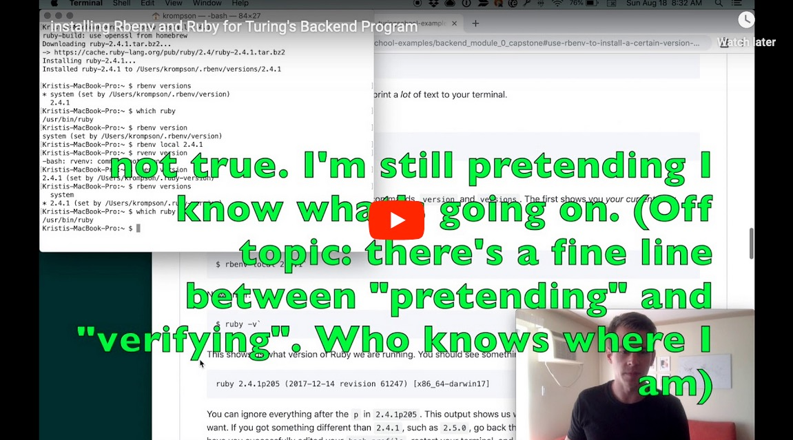

# Backend Mod 1 Pre-work Repository

This repository will walk you through the Mod 1 Pre-work for the Backend program at Turing.

Each day has a folder containing a `README.md` file with instructions for the section, exercises, and questions. Please complete all the exercises and questions, as well as lessons listed in the section's README.

### Pre-work Index

* [Section 1 - SUPER LEARNERS, Terminal and Ruby Foundations](section1)
* [Section 2 - ASKING QUESTIONS, Conditionals and Methods](section2)
* [Section 3 - GROWTH MINDSET, Hashes](section3)
* [Section 4 - HOW YOU USE YOUR TIME, Objects and Classes](section4)
* [Final Prep - Final Deliverables and Submission](final_prep)

## What to Expect

Through completing this pre-work, you can expect to get practice re-inforcing what you learned/are learning in Mod 0, learn more technical content, and deeply reflect on your mindsets and habits and start thinking about which of those mindsets and habits will help you learn to code, and which of those you may need to change.

We will remind you of the best practices that follow from time-to-time, but to ground yourself in the work ahead, read them carefully.

## Best Practices: Learning to Write Code

**If you are stuck for longer than 30 minutes, know that it is always ok to ask for help!** The process of becoming a software developer is difficult, and learning to code is hard. At some point, everyone struggles. Struggle is a normal, healthy part of the learning process - don't give up if you hit a hard spot. If you consistently practice every day and don't take shortcuts, you will be on the path to learning how to code. When you reach out for help, challenge yourself to ask clear questions and use technical vocabulary. Speaking accurately about code is a great way to help lock in technical understanding. Use [this guide](https://gist.github.com/ericweissman/fb0241e226227867b6bc70a4d49227f5) to learn the optimial way to ask for help when you get stuck!

**Process over Product.** When asking for help, do your best to seek understanding rather than `the answer` or `the solution`. Even if your helper gets you a solution that works, make sure to spend time on *why* it works, rather than just accepting the solution and moving on.

**Type every line of code.** One of the best things you can do to set yourself for success is to make sure you type out all the code examples you see in the readings and exercises in this pre-work, *do not* copy and paste. The more hands-on-keyboard practice you can give yourself, the better. Copying and pasting won't help you solidify these concepts, manually typing all the code in will. This also applies to auto complete features in popular text editors. They are helpful, no doubt, but doing things the hard way at the beginning is a great way to hone your workflow later on.

**Details matter.** Pay close attention to small details in syntax, spacing, and language. The most detailed oriented you are as you're working, the more reliable and well-crafted your code will be. In programming, being detail oriented helps cut down on buggy code and difficult to use systems. It can also help you notice differences in your code, enabling you to identify typos and mistakes more quickly.

# Environment

Before we can experiment with coding out the concepts we will learn in Mod0, we need to do a bit more setup to prepare a Ruby-specific development environment.

Follow this guide step-by-step to make sure you have everything you need, then you will be ready to start your first day of work!

***Before proceeding***, if you have not already, complete the [mod-0 environment setup instructions](http://mod0.turing.io/setup-instructions) to install Atom, xcode-select, Homebrew, git, and Chrome.

<!-- We will cover the following:

*   [Installing Rbenv - a Ruby Version Manager](#set-up-ruby-environment-manager-rbenv)
*   [Installing Ruby Versions using Rbenv](#use-rbenv-to-install-a-certain-version-of-ruby)
*   [Terminal](#terminal) -->
*   [Forking and Cloning the Prework Repository](#forking-the-module-1-prework-repository)


<!-- First, let's get a Ruby version management tool on our machines. -->
<!-- 
 ## Set up Ruby Environment Manager: [rbenv](https://github.com/rbenv/rbenv#homebrew-on-mac-os-x) -->

<!-- Over the years, Ruby has evolved through various version releases over time that contain new features and upgrades. Version 0.95, the very first, was released in 1995, and at the beginning of year 2021, we're at version 2.7.

Generally, programs written in one version of Ruby will run just fine on another version, but sometimes incompatibilities can be encountered, meaning that particular program needs to be run with a specific version of Ruby.

Additionally, very useful tools called "gems" are out there that were created specifically to help developers code (specifically, the `pry` gem is very handy) and we cannot utilize these without first installing and configuring `rbenv`.

To solve potential compatability issues, we'd like to be able to install and manage multiple versions of Ruby on our system. We would also like to be able to use gems across different versions of Ruby. These are the kinds of things `rbenv` handles. -->

<!-- ### Installation

#### NOTE: If you have any issues with the `rbenv` setup, please message Eric Weissman on slack (@ericweissman) and we will address your issues at a later date! You're system version of ruby will work fine for your Prework exercises!

Here is a video walk-through that may be helpful for the following steps. Check it out!

Keep in mind that the steps in the video are correct, but we want you to install **ruby version 2.7.2**, per the written instructions below. --> -->

<!-- [](https://youtu.be/3DtqMlK8In0 "Video Walkthrough for RBENV and Ruby Installation") -->

<!-- Similar to Homebrew, rbenv provides a script to get everything installed. Open a terminal with Spotlight search (`Command + Space`) and enter these commands:

```
$ brew update
```
Wait a few moments for `brew` to check its current version and make sure it is ready to be used.

```
$ brew install rbenv
```
Wait again, as brew installs rbenv.

```
$ rbenv init
```

The output from your terminal should be something similar to:

```
$ rbenv init
.
.
.
# Load rbenv automatically by appending
# the following to ~/.zshrc:

eval "$(rbenv init -)"
```

This output is telling you that you will need to add the above line (beginning with `eval`) to your "bash profile".

To do this, in your terminal, enter:

```
$ atom ~/.zshrc
```

This command will open up your `ZSH Runtime Configuration` file in Atom so you can edit it. Copy the line `eval "$(rbenv init -)"` and paste it at the END of the `.zshrc` file, and save it.

Check to see if you did this step correctly by switching back to your terminal and typing `cat ~/.zshrc`. You should see `eval "$(rbenv init -)"` at the bottom of the output.

After, **close your terminal and reopen it.** This is a very important step since the bash profile is loaded each time a new terminal window is opened.

Now, check to make sure rbenv was installed properly. In your terminal, type:

```
$ rbenv versions
```

It should give you a version number rather than an error message.

More information about rbenv can be found [here](https://github.com/rbenv/rbenv#homebrew-on-mac-os-x). -->

<!-- ### Use rbenv to install a certain version of Ruby

Now that we have rbenv installed, we're going to use it to install a specific version of Ruby: Ruby 2.7.2. This is the version we will use in the Backend Program.

If you need another version it'll be the same procedure, just replace `2.7.2` in the instructions with whichever version you want.

Install it with:

```
$ rbenv install 2.7.2
```

It will take a while to finish installing, and print a _lot_ of text to your terminal.

When it's all finished, type:

```
$ rbenv versions
```

and you should now see `2.7.2` listed.

Be careful, there are two different rbenv commands, `version` and `versions`. The first shows you _your current ruby version_. The second shows _all installed versions_.

Switch to your newly installed version with

```
$ rbenv local 2.7.2
```

Now enter:

```
$ ruby -v
```

This shows us what version of Ruby we are running. You should see something like:

```
ruby 2.7.2p105 (2018-10-18 revision 65156) [x86_64-darwin17]
```

You can ignore everything after the `p` in `2.7.2p105`- the first bit shows us we are running Ruby 2.7.2, which is what we want to verify. If you got something different than `2.7.2`, such as `2.4.1`, go back through the Rbenv installation, make sure you have you successfully edited your `bash_profile`, restart your terminal, and try again. -->

<!-- #### Setting the Default Version

You can tell rbenv which Ruby version you want to use by default. Let's do that with terminal command:

```
$ rbenv global 2.7.2
```

Now, let's make your terminal aware of this update with command:

```
$ rbenv rehash
```

## Terminal

We will be referencing many terminal commands throughout the prework. It is recommended that you practice using terminal commands before getting started with section1. -->
<!-- 
[Check out section 1 to practice!](section1) -->

### Forking the Module 1 Prework Repository

Next, we are going to *fork this repository that you're reading right now*. Forking is when you copy a Github repository to your Github account to make your own changes. Think of it like a fork in the road -- you're about to make changes that differ from the main path.

In this scenario, the [Turing Github account](https://github.com/turingschool) owns this `backend_mod_1_prework` repository. You do not have permission to change anything in this repository, so you need your own copy to work on.

In order to fork the repository, follow these steps:

####  1. Make sure you are logged in to GitHub (if you are not logged in, log in and come back to this page)

####  2. You'll want to find this repository's Fork button. Scroll to the top of *this* webpage... yes, [this one](https://github.com/turingschool/backend_mod_1_prework) that you're reading right now!

####  3. Click on `Fork` in the upper right corner of the screen, just under the top banner.


####  4. On the new page, confirm that it is a "forked" copy of the repository, with your username included in the URL and repository name.


Check [github help](https://help.github.com/en/github/getting-started-with-github/fork-a-repo) out for more info about forks.

## Clone down this new repository

Now that you have forked this repository, the next thing to do is *clone* your forked repository.

Cloning is when you copy a remote Github repository to your local computer.

#### 1. In YOUR `backend_mod_1_prework` repository that your just forked, click on `Clone or Download`


#### 2. If you see `Clone with HTTPS` click on `Use SSH`

#### 3. Click on the copy icon to copy the SSH link to your clipboard.

#### 4. Open your terminal and follow the below steps to copy down this repository:

```
$ cd .
// This is a shortcut for `cd ~`, which is "change into the home directory"
$ mkdir turing
$ cd turing
$ mkdir 0module
$ cd 0module
$ git clone <ctrl-v to paste ssh link here >
Cloning into 'backend_mod_1_prework'...
remote: Enumerating objects: 678, done.
remote: Total 678 (delta 0), reused 0 (delta 0), pack-reused 678
Receiving objects: 100% (678/678), 237.94 KiB | 851.00 KiB/s, done.
Resolving deltas: 100% (332/332), done.

$ cd backend_mod_1_prework
$ git status .
// If everything worked correctly, you should see:
On branch main
nothing to commit, working tree clean
```

From here on out, all the work you do will be in your personal copy of this repository. Throughout Mod 0, we may call this your "prework repository" or "backend prework"... this refers to your forked copy of this `backend_mod_1_prework` repository that you have just now cloned to your device.

### IMPORTANT NOTE - PLEASE READ CAREFULLY
Do **NOT** work directly in the Github interface or use the `Edit` button to work directly from the Github version of your prework repository! 

Instead, add your work in your text editor (Atom) on your local machine (laptop) - your prework involves using `git` to track changes and push your work up to Github. We will cover how to do this in Mod 0 AND we give explicit instructions on how to do this in each section of the prework!

## Get Started

Each day's `README` will walk you through the necessary steps to save your work.

To begin, open your terminal and `cd` into the `section1` directory. Follow the instructions contained in the `README.md` file, and have fun experimenting!

----------------------------------

