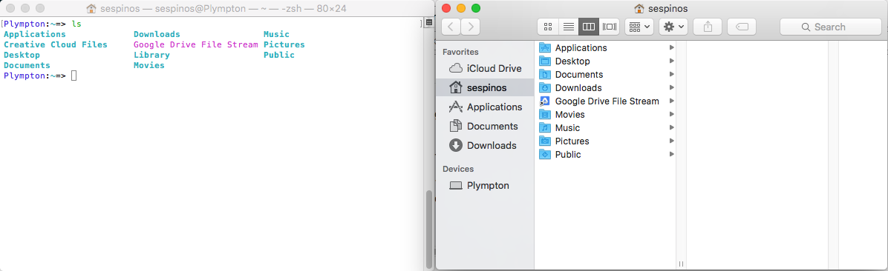

## Dive Right In!

You will likely spend the majority of your time in Module 1 in either the Terminal or your text editor. When you're new to programming, the terminal can seem like a scary place, but it has some advantages over other means of interacting with your computer. Perhaps the greatest advantage is that it allows programmers to build tools that they can share with each other without going through the process of creating a graphical user interface. This makes it easy to share code quickly so that it can be used in multiple projects.

Before we get started, go ahead and open the terminal on your computer. If you're on a Mac, the easiest way to do this will be to use Spotlight. Press `command-space` at the same time and a small box should open up on top of your other windows.


Go ahead and start typing `Terminal`, and you should see your computer attempt to locate the file or program you're trying to find. If you have a lot of other programs or files with `term` in the name, you might have to type the full word, but if not, you should be able to type a letters until Spotlight correctly guesses that you're looking for the program `Terminal`. Once you see that, hit return and your terminal should open.

It will likely look something like the image below.


Now, type `ls` and hit return. You should see a list of directories that are in your home directory on your computer. You should be able to confirm this by opening the finder (go ahead and hit `command-space` to activate Spotlight and start typing `finder`) and navigating to that same home directory. Notice in the image below that my terminal window lists `Applications`, and `Desktop`, and `Documents`, etc. while my finder shows those same directories.



**This is key:** the terminal gives you a different way to work with your computer, but it's not completely separate. All of the files that you create and edit with your terminal, you can also view with your finder and a text editor or other program.

There are **many** commands that you can learn before you would be considered an expert at using the terminal, but you only really need a few to get started. Let's work on those below.

## Getting Around

### Commands

When navigating the filesystem in text form, it can sometimes be difficult to remember where you are and where you're going. There are three big commands that will help keep you oriented in the terminal.

* `pwd`: Stands for Print Working Directory. This will tell you where you are now. It gives you the full path all the way from your computers very top directory, or the `root`. When I type `pwd` in my terminal after just starting it up, I get the following:

```sh
/Users/sespinos
```

This tells me that I'm in the `sespinos` directory, which is inside of the `Users` directory, which itself is in the `root` directory (represented by that very first `/`).

* `ls`: Short for `list`, this command will list all of the files and directories inside of my current directory. So, for example, when I am in my home directory (`/Users/sespinos`) and I type `ls`, I see the following:

```sh
Applications             Downloads                Music
Creative Cloud Files     Google Drive File Stream Pictures
Desktop                  Library                  Public
Documents                Movies
```

This is a list of all the directories in my home directory. Great!

* `cd`: Short for `change directory` will allow you to move, but you have to tell it where to go! So, for example, if I'm still in my home directory I can type `cd Desktop`, then when I enter `pwd` my terminal should print out `/Users/sespinos/Desktop`, and if I type `ls` it should list all of the files that are currently on my desktop.

I can also move back up out of the directory that I moved into by typing `cd ../`. Those two dots mean move one directory up.

If I know my directory structure pretty well (because I spend way to much time working on my laptop), I can chain locations together. For example, assuming I have a `turing` directory in my `Documents` directory and I'm currently in my home directory I can type the following to move directly into the `turing` directory: `cd Documents/turing`. If I then enter `pwd`, my current directory should be `/Users/sespinos/Documents/turing`. This also works going the other way. Assuming I'm in my `turing` directory, I can use the following command to get back to my home directory: `cd ../../`.

* `~/`: A special shortcut, `~/` represents my home directory no matter where I am on my laptop. So, for example, if I am deep into my Documents directory and I just want to go home I can type `cd ~/` and it will take me all the way back up to my home directory.

### Practice

Use the commands listed above to move around your computer.

* Go deep down into one of your the existing directories using `cd` to move and `ls` to see what directories are available.
* Navigate out using `cd ../` to get back to your home directory. Try to use `pwd` to make sure you don't overshoot it!
* Dig deep into another directory, using `ls` as you go.
* Use `cd ~/` to navigate back out to your home directory.
* Navigate into your Downloads directory using `cd Downloads`.
* Navigate to your Desktop using `cd ~/Desktop`.
* Use `pwd` and `ls` to confirm your current location.

Continue practicing these commands until you feel comfortable moving around without having to look at this lesson.

## Making Things

### Commands

* `touch`: This command will create a new file. It does so without putting anything in that file, so you could type `touch student.rb` to create an empty Ruby file, or `touch portfolio.md` to create an empty Markdown file. In both cases the filetype is indicated by the extension at the end of the filename. Each of these files would then be available for you to edit in your text editor. If you're used to using other Mac applications, `touch` is the command line equivalent of "command-n" to create a new document in other programs.

* `mkdir`: Short for 'make directory,' this command will create a new directory or folder in your file system. As your projects become more complicated the files in your projects will multiply and it will be important to use directories to keep them organized.

* Working from home: As with `cd` and `ls` you can use `mkdir` and `touch` to create deeply nested files and directories without `cd`ing into them. So, for example, if I wanted to create a file named `secret_library.rb` inside of a directory named `lib`, which itself was inside of a directory named `secret_library` inside of an existing `~/Documents/turing/1module` directory *and* a `secret_library_test.rb` file inside of a `test` directory inside the same project folder, I could run the following commands to make that happen.

```sh
$ cd ~/Documents/turing/1module
$ mkdir secret_library
$ cd secret_library
$ mkdir lib
$ touch lib/secret_library.rb
$ mkdir test
$ touch test/secret_library_test.rb
```

This feels like a pretty authentic way to start a new project to me. I first `cd` to the place I want to create the directory that's going to hold the project and create that directory. Then I `cd` into that directory and start setting up my file/directory structure from there. Note that I don't `cd` down into the `test` or `lib` directories to create the files. I could, but generally we like to run and create our code from the project directory (it gives us the most flexibility in how we write and run our code, which we will discuss more later).

Note that I could've also done the following:

```sh
$ mkdir ~/Documents/secret_library
$ mkdir ~/Documents/secret_library/lib
$ touch ~/Documents/secret_library/lib/secret_library.rb
$ mkdir ~/Documents/secret_library/test
$ touch ~/Documents/secret_library/test/secret_library_test.rb
```

This would have the exact same impact, but gives me a whole lot more to type and makes it a little more difficult to run my code. I include it here only to make the point that you don't have to use `cd` into a specific directory every time you want to make a new directory or file.

### Practice

Use `mkdir` and `touch` to create the directories/files in the structure described below.

```sh
|-- _secret_library
    |
    |--README.md
    |--Gemfile
    |--Rakefile
    |
    |--_lib
    |  |
    |  |--secret_library.rb
    |  |--secret_book.rb
    |  |--secret_librarian.rb
    |  |--patron.rb
    |  |--library_system.rb
    |
    |--_test
       |
       |--secret_library_test.rb
       |--secret_book_test.rb
       |--secret_librarian_test.rb
       |--patron_test.rb
       |--library_system_test.rb
```     

Don't worry about putting any text into these files. For now, just create this structure and empty files.

## Deleting Things

### Commands

* `rm`: This will remove a file from your system. Be careful with this! The terminal assumes you're a little more of an expert than the system does. This doesn't move the file to the Trash, it removes it completely from your system. It's a little like moving the file to the trash and then deleting it immediately.

* `rm -rf`: Adding the `-r` and `-f` flags to the `rm` command will allow you to delete directories even if they have other files and/or directories inside of them. For more information on each of these flags enter `man rm` into your terminal. It will print out the manual for this command.

### Practice

Use `rm` and `rm -rf` to delete each of the files and directories you created in the Making Things section above. Note, that it would be possible to delete the entire directory that you created with just `rm -rf secret_library`. **Don't do this!** At this point it's better for you to delete each of the files and directories individually so that you get some practice with these commands, which will help you remembber them better in the long run. The goal here (for this particular exercise) isn't to be efficient and creating and deleting files and directories, it's to *get practice* creating and deleting files and directories. Ultimately this practice will allow you to be more efficient in the future.
